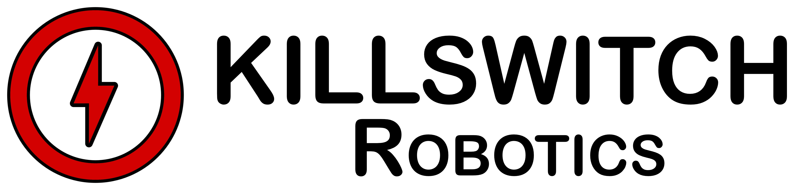

Killswitch Robotics provides enterprise-grade management and safety solutions for autonomous humanoid AI robotic fleets.

---

## Our Products

### Killswitch Console

Cloud-based platform for comprehensive fleet management. Features:

- Centralized control and monitoring of multi-vendor AI robots
- Integrated vendor control systems for seamless operations
- Real-time two-way audio/video communication
- AI-native inventory and asset management
- Advanced telemetry aggregation and historical analysis
- Predictive maintenance scheduling
- One-click emergency killswitch activation

Platform Demo Here:

### Killswitch Terminator

Hardware module for fail-safe control and emergency stopping. Features:

- Independent control system bypassing AI compute
- Instant power interruption and system disconnect
- Tamper-resistant design for maximum security
- Dedicated compute and networking for autonomous operation
- Compatible with add-on audio/video systems
- Multiple activation methods: manual, remote, and automated
- Engineered to prevent AI override or malfunction scenarios (No SkyNet scenarios here!)
- Upgraded hardware can run local AI supervisory models, enabling continuous monitoring and alerting. 

Terminator POC overview:

---

### AI humanoid robotics are here. Are you prepared?

- **Multi-Vendor Fleet Management**
- **Emergency Killswitch Technology**
- **Advanced Security Protocols**
- **Real-Time Monitoring and Analytics**

---

## Why Choose Killswitch?

### Unified Control
Manage diverse robot fleets from a single, intuitive interface.

### Enhanced Safety & Security
Hardware device features independent killswitch technology, ensuring you're always in control.

### Scalable Solution
From individual units to enterprise-level deployments, we've got you covered.

### Compliance Ready
Stay ahead of regulatory requirements with our platform.

---

## Contact Us

[Fill out this form](https://forms.gle/BkBHsk7ZVjfM1xDb8) to contact us!

---

© 2024 Killswitch Robotics | All Rights Reserved
